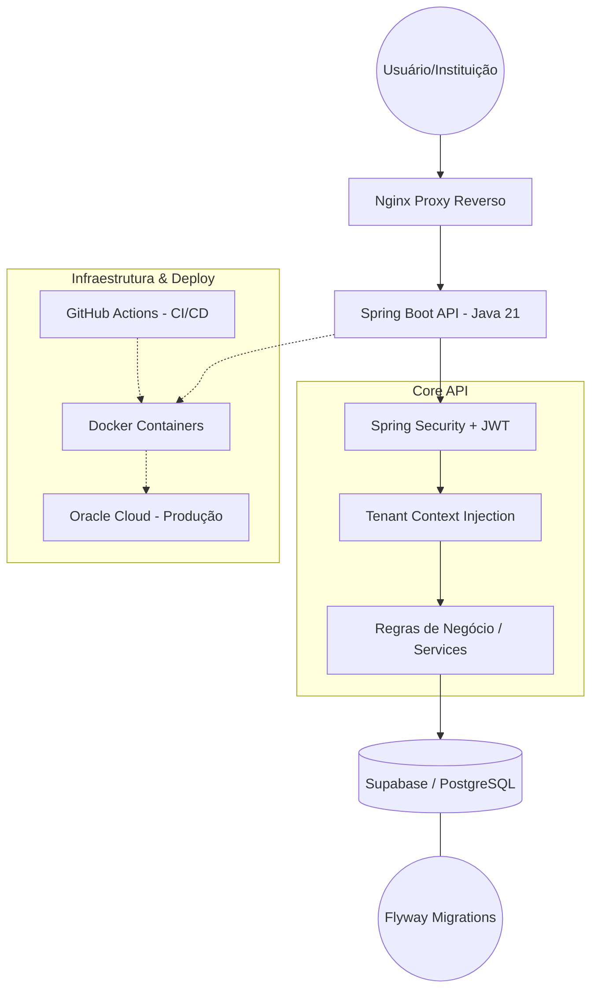
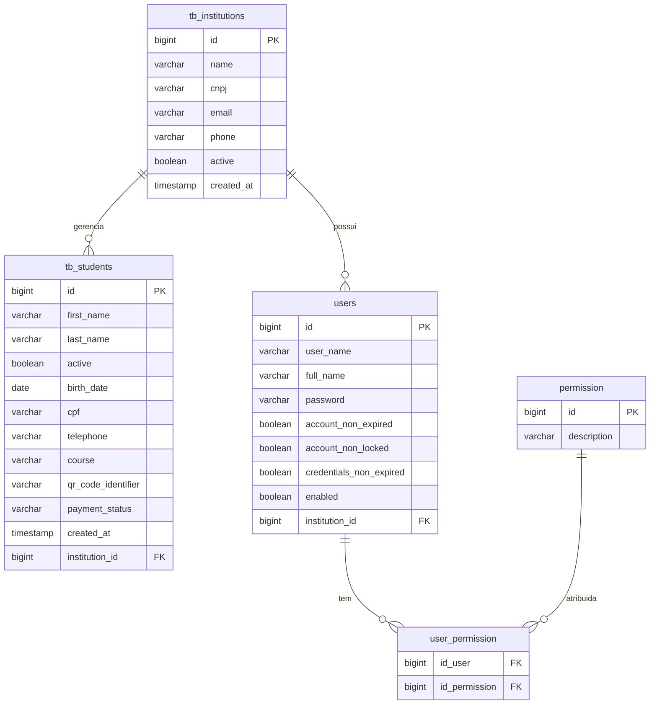

# Plataforma de Gestão de Transporte Universitário

[PLACEHOLDER: Inserir logo ou banner do projeto]

## Visão Geral

Este é um repositório **vitrine (Showcase)** de um projeto de gestão de transporte universitário. O código-fonte completo é privado, por tratar-se de um software proprietário desenvolvido sob demanda.

Esta vitrine tem como objetivo demonstrar a arquitetura, as decisões de engenharia de software e a qualidade do código implementado, respeitando os acordos de confidencialidade com o cliente.

## Sobre o Projeto

Plataforma SaaS Multi-Tenant projetada para automatizar a gestão de transporte universitário. O sistema permite que múltiplas instituições gerenciem alunos, rotas e fluxos financeiros de forma isolada, escalável e segura.

**Destaques Técnicos:**
- **Arquitetura SaaS Multi-Tenant:** Estratégia de *Shared Database* com isolamento lógico robusto.
- **Segurança Contextual:** Autenticação stateless com Spring Security, JWT e propagação de contexto de Tenant.
- **Infraestrutura Cloud:** Deploy conteinerizado na Oracle Cloud (Produção) com persistência no Supabase/PostgreSQL.

## Stack Tecnológica

- **Backend:** Java 21, Spring Boot 3
- **Segurança:** Spring Security, JWT (Stateless), RBAC (Role-Based Access Control)
- **Dados:** PostgreSQL, Flyway (Database Versioning), Spring Data JPA
- **Observabilidade:** SLF4J/Logback (Logs estruturados), Tratamento Global de Exceções
- **Testes:** JUnit 5, Mockito
- **DevOps:** Docker, GitHub Actions (CI/CD), Nginx (Proxy Reverso)
- **Cloud:** Oracle Cloud Infrastructure (OCI), AWS (Homologação)

## Arquitetura e Fluxo

O sistema adota uma arquitetura de API RESTful, conteinerizada e orquestrada via pipeline de entrega contínua.

## Diferenciais de Engenharia (Multi-Tenancy)

O isolamento de dados é o pilar central da aplicação, implementado via Shared Database:

- **Isolamento Lógico:** Todas as instituições compartilham a mesma base, mas o isolamento é garantido na camada de serviço.
- **Injeção de Contexto:** Um filtro intercepta as requisições, valida o token JWT e carrega o usuário autenticado (incluindo sua instituição) no contexto de segurança.
- **Persistência Segura:** Os Services consultam a instituição do usuário autenticado para filtrar automaticamente os dados, impedindo qualquer vazamento (*Cross-tenant access*).

## Snippets (Highlights do Código)

Abaixo estão trechos reais do código (higienizados) que demonstram padrões de projeto e maturidade técnica:

**Segurança e RBAC:** Configuração de proteção de rotas e filtros JWT.
- [SecurityConfig.java](snippets/SecurityConfig.java)

**Multi-Tenancy em Services:** Lógica de isolamento e recuperação do Tenant Context.
- [StudentService.java](snippets/StudentService.java)

**Filtro de Autenticação:** Interceptor responsável pela validação e população do contexto.
- [JwtTokenFilter.java](snippets/JwtTokenFilter.java)

**Observabilidade & Erros:** Handler centralizado para padronização de respostas (RFC 7807) e logs estruturados.
- [ErrorHandler.java](snippets/ErrorHandler.java)

## Documentação Técnica

- **API Specification:** Documentação via Swagger/OpenAPI integrada ao ecossistema Spring.

### Modelagem de Dados

O diagrama abaixo reflete a estrutura exata do banco de dados (ER Diagram), evidenciando as tabelas e relacionamentos chave do sistema.

## Contato

Sinta-se à vontade para entrar em contato para discussões técnicas ou oportunidades:

- **LinkedIn:** [linkedin.com/in/guilherme-garap](https://linkedin.com/in/guilherme-garap)
- **E-mail:** [guilhermegarap@gmail.com](mailto:guilhermegarap@gmail.com)
- **Portfólio:** [guilhermegarap.github.io/guilherme-portf/](https://guilhermegarap.github.io/guilherme-portf/)
